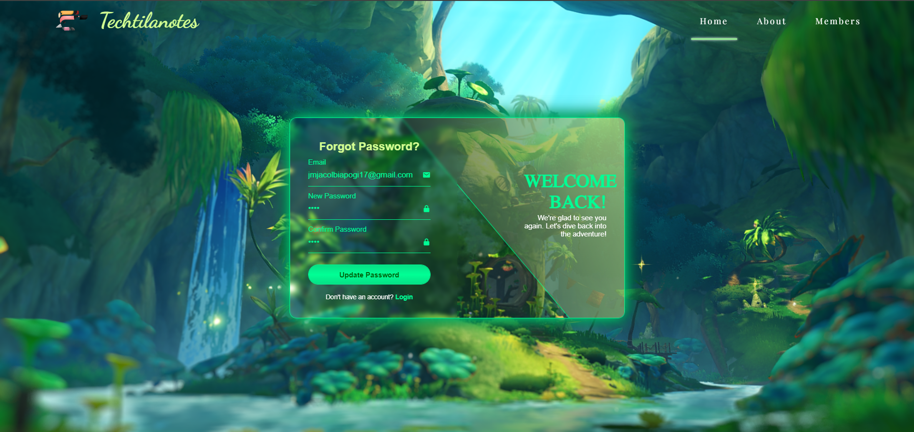
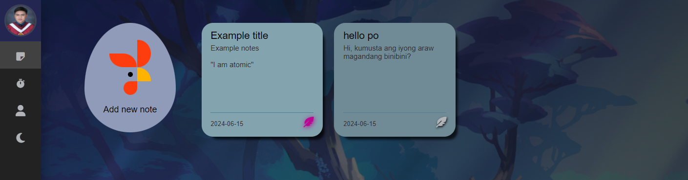

# Login

This is a login where the user can log in to their existing email or registered account.

# Register

If the user doesn't have an account, user can register or sign up. user must complete the requirements (first name, last name, email, and password).

# Forgot Password?

If the user forgot his or her password, user must click the "forgot password?" button below the login page.

# Note Light & dark mode

In light and dark mode, to keep the user's eyes comfortable, just click the moon or sun icon in the navigation bar.

### Light Mode

### Dark Mode

# Add note

To add a note, just click the egg icon with a chicken to add a note.

# Edit note

To edit the note, the user must click the added or existing note.

# Pin note and unpin note
### Unpinned note

To pin the note, the user clicks the feather icon below the note. Once the note is pinned, the feather will glow.

### Pinned note

To unpin the note, the user clicks the feather icon below the note. Once the note is unpinned, the feather will return to normal.

# Delete note

To delete the note, the user clicks the feather icon below the note and click the delete button or the trash icon.

# Pomodoro
### Worked time

In worked time, the timer automatically has 25 minutes to work. Once the timer starts, there is a button with which you can pause and restart.

### Break time

In break time, the user has 5 minutes to break, which allows the user to restart from worked time.

# Profile
### Changing name 

The user is allowed to edit her/his name ever time he/she wants.

### Changing profile picture

To change your profile picture, just click your profile picture to select a photo from your device.

